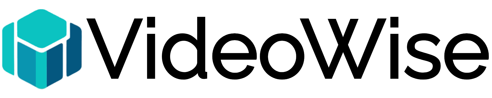

# VideoWise
VideoWise is an application that allows users to upload videos, which are then transcribed using [WhisperX](https://github.com/m-bain/whisperX) (based on the [Whisper](https://github.com/openai/whisper) OpenAI model) in the user's chosen language. The transcription and timestamps enable users to quickly navigate through the uploaded video, as each transcribed sentence is associated with its relative timestamp.
Additionally, **VideoWise** integrates with [Ollama](https://github.com/ollama/ollama) to allow users to communicate with an AI model of their choosing and ask questions about the transcribed video, such as requesting a summary or generating a quiz or documentation.
Users can also export the chat in various formats or the transcribed video with subtitles applied.
## Key Features
- Upload videos to the app
- Transcribe and translate videos using the WhisperX model in one of the currently available languages, which are `{en, fr, de, es, it, ja, zh, nl, uk, pt}`
- Associate transcribed sentences with their relative timestamps for easy navigation
- Communicate with an AI using OLLama to ask questions about the transcribed video
- Export the chat in various formats or the transcribed video with subtitles
## Setup
### Requirements
- **Ollama** (tested with *v0.3.12* and *v0.4.5*)
- **Docker Desktop** (tested with *v24.0.2*) or **Docker Engine** (tested with *v24.0.7*)
- **NVIDIA GPU** with installed drivers *[optional]* for optimal transcription performance.
### Installation
**VideoWise** offers two different installation methods:
#### 1. Simple Setup (Recommended for Quick Start)
This method is ideal for users who want a fast and simple installation. It runs the entire application on a single machine.

#### 2. Modular Setup (For Advanced Users) 
