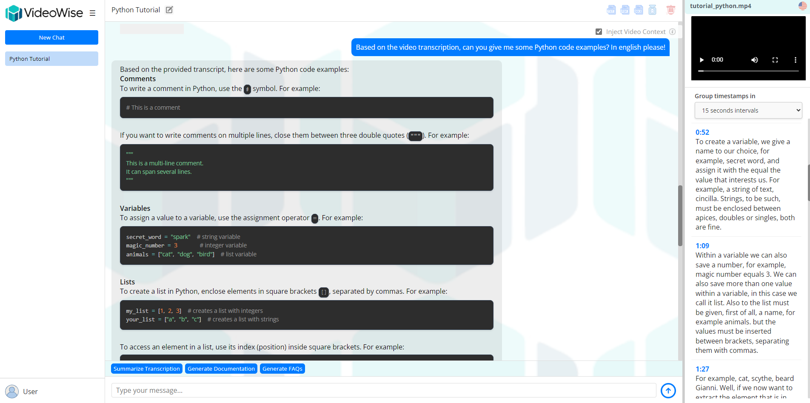

# VideoWise
In an age where video content dominates our digital interactions, finding key information within hours of footage can feel like searching for a needle in a haystack. VideoWise transforms the way you manage and interact with video content by making it **searchable**, **interactive**, and **insightful**. Whether you’re navigating a training session, analyzing a lecture, or creating engaging content, VideoWise makes working with videos more efficient and effective.\
<br>
At its core, VideoWise provides a web application to upload videos, which are then transcribed using [WhisperX](https://github.com/m-bain/whisperX, a highly efficient and accurate tool based on the [Whisper](https://github.com/openai/whisper) OpenAI model. Each sentence is tied to a precise timestamp, enabling effortless navigation through hours of content without the frustration of scrubbing timelines.\
Going beyond transcription, **VideoWise** integrates with [Ollama](https://github.com/ollama/ollama), enabling users to interact with an AI assistant to ask questions about the video, generate summaries, or even create quizzes and documentation. Export options let users save the AI-powered chats in various formats or download the transcribed video with subtitles applied.
## Key Features
- Upload videos to the app
- Transcribe and translate videos using the WhisperX model in one of the currently available languages, which are `{en, fr, de, es, it, ja, zh, nl, uk, pt}`
- Automatically associate transcribed sentences with their relative timestamps for easy navigation
- Communicate with an AI using Ollama to ask questions about the transcribed video
- Export the chat in various formats or the transcribed video with subtitles
## Setup
### Requirements
- **Ollama** (tested with *v0.3.12* and *v0.4.5*)
- **Docker Desktop** (tested with *v24.0.2*) or **Docker Engine** (tested with *v24.0.7*)
- **NVIDIA GPU** with installed drivers *[optional]* for optimal transcription performance.
### Installation
**VideoWise** offers two different installation methods:
#### 1. Simple Setup (Recommended for Quick Start)
This method is ideal for users who want a fast and simple installation. It runs the entire application on a single machine.
#### **Steps**
1. Install the required dependencies (Ollama and Docker)
2. Configure the Ollama API URL in the `.env` file. To do so, be sure to substitute `<your_machine_ip>` in `OLLAMA_API_URL` with the actual IP of the machine running Ollama.
3. Run **Docker Compose** to build and start the application:
   ```bash
   docker-compose up --build
   ```
At the end of the process, you'll be able to access the application on `http://localhost:80`. 
#### 2. Modular Setup (For Advanced Users) 
The modular setup allows more flexibility and is ideal for separating services onto different machines (e.g., running the WhisperX transcription service on a GPU-equipped system). This setup requires manual configuration of each service.
<br>
- **Application Modules**
  -  **Main Server**: Acts as a central hub for all communication between modules.
  -  **Web UI Client**: The front-end interface for the application.
  -  **FileSystem Server**: Manages uploaded/generated files and handles video streaming.
  -  **Python Server**: Interfaces with WhisperX for transcription and performs file conversions (HTML to PDF/DOCX).
  -  **DataBase Service**: PostgreSQL instance storing non-file data (e.g., chats, users).
- **Steps** 
  1. Install **Docker** on every machine where a service will run and **Ollama** on the one that will provide the AI chat functionality. 
  2. Build and run the **Database Service** with:
     ```bash
     cd videowise-db
     ./start_db.sh
     ```
  3. Build and run the **Python Service** with:
     ```bash
     cd videowise-python-service
     docker build -t videowise-python-service .
     docker run -d --name videowise-python-service -p 8000:8000 videowise-python-service
     ```
  4. Build and run the **FileSystem Service** with:
     ```bash
     cd videowise-filesystem-service
     docker build -t videowise-filesystem-service .
     docker run -d --name videowise-filesystem-service -p 8081:8081 videowise-filesystem-service
     ```
  5. Set up the Environment Variables for the **Main Server**.\
     Edit `/videowise-main-service/Dockerfile`, lines _11-16_ and _37-42_
     ```markdown
     # ENV OLLAMA_API_URL="http://<your_ollama_ip>:11434/api/chat" \
     # ENV QUARKUS_DATASOURCE_JDBC_URL="jdbc:postgresql://<your_db_ip>:5432/video_transcriptions_db" \
     # ENV FILESYSTEM_API_URL="http://<your_fs_service_ip>:8081" \
     # ENV FILESYSTEM_STREAMING_API_URL="http://<your_fs_service_ip>:8081" \
     # ENV WHISPER_API_URL="http://<your_python_service_ip>:8000"
     ```
     uncommenting them and replacing placeholders with the appropriate IP addresses.
  6. Build and run the **Main Server** with:
     ```bash
     cd videowise-main-service
     docker build -t videowise-main-service .
     docker run -d --name videowise-main-service -p 8080:8080 videowise-main-service
     ```
  7. Set up the *Main Service URL* Environment variable for the **Web UI Client**, in `/videowise-ui-client/Dockerfile`
     ```markdown
     # ENV MAIN_SERVICE_URL="http://<your_main_service_ip>:8080"
     ```
     Uncomment this line and substitute the placeholder with your machine's IP address
  8. Build and run the **Web UI Client** with:
     ```bash
     cd videowise-ui-client
     docker build -t videowise-ui-client .
     docker run -d --name videowise-ui-client -p 80:80 videowise-ui-client
     ```

     
